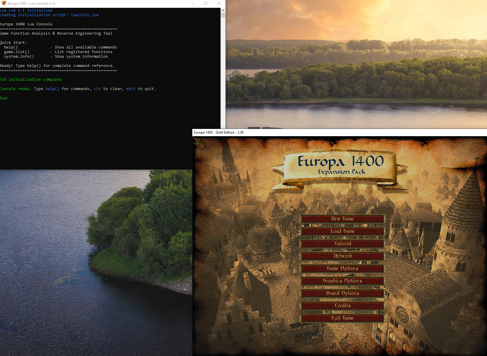

# Europa 1400 Lua Console

**A reverse engineering and analysis toolkit for Europa 1400: The Guild**

An interactive Lua console that runs directly inside the game process. Designed for reverse engineers, modders, and game researchers who want to understand and interact with Europa 1400's internals.

---

## 🎯 **What is this?**

This is a **DLL injection mod** that provides:

- 🔧 **Interactive Lua Console** - Execute scripts directly in the game process
- 🎮 **Game Function Calling** - Call discovered functions from Ghidra analysis
- 🧠 **Memory Operations** - Read/write game memory in real-time
- 📊 **System Diagnostics** - Comprehensive process and system analysis tools
- 💾 **Persistent Analysis** - Save and share your reverse engineering work
- 🔍 **Advanced Debugging** - Function call logging, parameter tracking, execution history

**Perfect for:** Game modding, reverse engineering, function analysis, memory research, and understanding game mechanics.

---

## ⚡ **Quick Start**

1. **Build and Install** (see [Installation](#-installation))
2. **Launch Europa 1400** → Console appears automatically  
3. **Start exploring:**
   ```lua
   help()                    -- Show all commands
   system.info()             -- System information  
   system.memory_info()      -- Memory status
   game.list()               -- List registered functions
   ```

4. **Register a function from Ghidra:**
   ```lua
   game.register("GetPlayerGold", 0x403000, "int()", "Get player gold")
   local gold = game.call("GetPlayerGold")
   print("Player has:", gold, "gold")
   ```

5. **Save your progress:**
   ```lua
   game.save("my_analysis.lua")
   ```

---

## 📸 **Screenshots**

### Console Interface & System Diagnostics


*The interactive Lua console showing system information, memory diagnostics, and command history features.*

### Window Info  


*The interactive Lua console showing window information*


---

## 🚀 **Key Features**

### **🎮 Game Function System**
- Direct function calling from Ghidra addresses
- Multiple calling conventions support
- Parameter validation and error handling
- Return value capture and logging

### **🧠 Memory Operations**
- Real-time memory read/write with type safety
- Struct support for complex data types
- Module base address resolution
- Memory layout analysis

### **📊 System Diagnostics**
- Complete system information (CPU, memory, architecture)
- Process window enumeration with full details
- Loaded module analysis with addresses and paths
- Memory usage monitoring with formatted output

### **🔍 Debugging & Logging**
- Function call history with timing information
- Parameter and return value tracking
- Memory operation logging with success/failure status
- Colored console output for better readability
- Command history with navigation (100 commands)

### **💾 Persistent Analysis**
- Save/load function registrations to files
- Build function libraries over time
- Share analysis work with other researchers
- Template-based organization

---

## 📦 **Installation**

### **Prerequisites**
- **Europa 1400: The Guild** (original game)
- **dxwrapper** for modern graphics compatibility
- **Wine** (Linux users) or **Windows**

### **Build Requirements**
- **Zig compiler** (latest stable)
- **LuaJIT source code** (included in vendor/)
- **Git** for cloning

### **Building from Source**

1. **Clone and setup:**
   ```bash
   git clone https://github.com/your-repo/europa1400-lua
   cd europa1400-lua
   ```

2. **Build LuaJIT:**
   ```bash
   make lua
   ```

3. **Build the console:**
   ```bash
   make
   ```

4. **Install to game directory:**
   ```bash
   make install
   ```

   This copies:
   - `luaapi.asi` → `~/.wine/drive_c/Guild/`
   - `lua/` directory with all scripts

### **Verify Installation**
1. Launch Europa 1400
2. Console window appears automatically  
3. You see: `"Europa 1400 Lua Console Ready"`
4. Type `help()` to see available commands

---

## 📖 **Documentation**

- **[Usage Guide](docs/USAGE.md)** - Detailed usage instructions and examples
- **[API Reference](docs/API.md)** - Complete function reference
- **[Examples](docs/EXAMPLES.md)** - Real-world reverse engineering workflows
- **[Troubleshooting](docs/TROUBLESHOOTING.md)** - Common issues and solutions

---

## 📁 **Project Structure**

```
europa1400-lua/
├── src/                   # C source code
├── scripts/lua/           # Lua scripts and modules
├── docs/                  # Documentation files
├── media/                 # Screenshots and images
├── vendor/luajit/         # LuaJIT source code
├── bin/                   # Built artifacts
└── Makefile              # Build system
```

---

## 🤝 **Contributing**

We welcome contributions! Here's how to get involved:

1. Fork the repository
2. Create a feature branch: `git checkout -b feature-name`
3. Make your changes with proper testing
4. Update documentation as needed
5. Submit a pull request

### **Areas for Contribution**
- 🔧 Additional system diagnostic functions
- 🎮 Game-specific analysis tools
- 📊 Enhanced debugging features
- 🛡️ Security and stability improvements
- 📖 Documentation and examples
- 🐛 Bug fixes and error handling

---

## 📄 **License**

This project is licensed under the **GPLv3 License** - see the [LICENSE](LICENSE) file for details.

**Important**: This software is for educational and research purposes. Always respect game terms of service and applicable laws when using reverse engineering tools.

---

## 🙏 **Acknowledgments**

- **LuaJIT Team** - Excellent Lua implementation with FFI
- **dxwrapper Project** - D3D8/D3D9/Vulkan compatibility layer
- **Ghidra Team** - Revolutionary reverse engineering platform
- **Europa 1400 Community** - Game preservation and modding support
- **Contributors** - Everyone who helps improve this project

---

## 📞 **Support & Community**

- 🐛 **Issues**: Report bugs and request features in [GitHub Issues](https://github.com/your-repo/europa1400-lua/issues)
- 💬 **Discussions**: Join conversations in [GitHub Discussions](https://github.com/your-repo/europa1400-lua/discussions)
- 📧 **Contact**: For questions about reverse engineering or advanced usage
- 🤝 **Contributing**: See [Contributing](#-contributing) section above

---

**Ready to dive deep into Europa 1400?** Start your reverse engineering journey! 🚀