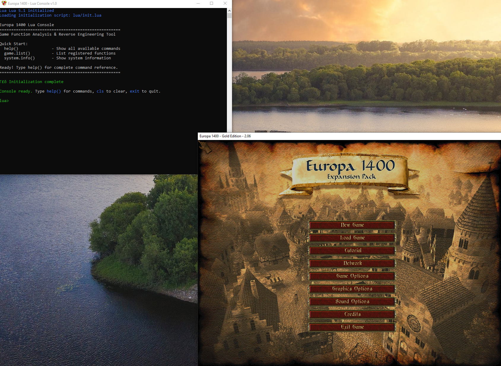

# Europa 1400 Lua Console

An interactive LuaJIT console that runs inside the Europa 1400: The Guild process, for
reverse engineering the game while it is running.



## Why

Reversing a 2001 Win32 game usually means alt-tabbing between Ghidra, Cheat Engine and a
debugger, and losing every finding when the process exits. This puts a Lua prompt in the
game instead: scan memory, follow pointer chains, disassemble, patch, hook, call a function
you just found in Ghidra, and save the whole session to a file you can re-run tomorrow.

```lua
lua> local hits = valuescan.int32(1500, 0x400000, 0x300000)   -- find your gold
lua> valuescan.update(hits, 1490)                             -- spend some, narrow it down
lua> game.register("GetPlayerGold", 0x403000, "int()", "from Ghidra")
lua> game.call("GetPlayerGold")
lua> session.save("gold.lua")
```

## Install

Needs [Zig](https://ziglang.org/) to build, and Wine or Windows plus an ASI loader
(the game is usually run with [dxwrapper](https://github.com/elishacloud/dxwrapper))
to run.

```bash
git clone --recurse-submodules https://github.com/maci0/europa1400-lua
cd europa1400-lua
make lua      # build LuaJIT for x86 Windows
make          # build bin/luaapi.asi
make install  # copy the ASI and scripts/lua/ into ~/.wine/drive_c/Guild/
```

Launch the game. A console window opens with `lua>`; type `help()` for the command list.
The DLL resolves its scripts from its own directory, so `luaapi.asi` and `lua/` have to sit
side by side.

Without the game, `make check` runs the Lua self-test on Linux against a stubbed kernel32.

## What is here

| Area | Modules |
|---|---|
| Memory | `scan` (AOB, dumps, regions), `valuescan` (live int/float scans with narrowing), `pointer` (module+RVA chains), `watch`, `diff`, `heap`, `dump` |
| Code | `disasm` (x86 triage view), `xrefs`, `finder` (string → xref → prologue), `sig` (masked AOBs), `near`, `stack` |
| PE / C++ | `exports`, `hook` (IAT), `vtable`, `rtti`, `obj` (thiscall), `struct`, `codegen` |
| Calling | `game` (register/call from Ghidra addresses), `probe` (find a signature without crashing), `fuzz`, `trace`, `patch` |
| Game domain | `player`, `city`, `building`, `unit`, `inventory`, `economy`, `world`, `quest`, `social`, `civic`, `state`, `snapshot`, `cheat`, `enums` |
| Workflow | `presets`, `catalog`, `auto`, `strings`, `session`, `report`, `threads`, `sysinfo` |

Full reference: **[docs/API.md](docs/API.md)**. Also
[Usage](docs/USAGE.md), [Examples](docs/EXAMPLES.md), [Troubleshooting](docs/TROUBLESHOOTING.md).


## Status

Working and exercised: the console itself, the memory, code, PE and C++ tooling, function
registration and calling, patching, hooking, session and report output. `make check` loads
all 49 modules and covers signature parsing, the disassembler and the save round-trip.

Not done yet, and worth knowing before you start:

- **No addresses are verified.** `catalog.lua` holds 4463 named candidates with signatures
  and tags, all `status="candidate"`; exactly one carries an AOB pattern and none carries a
  resolved address. It is a naming and search aid, not a list of reversed functions.
  `catalog.register_all()` therefore registers nothing until you fill addresses in.
- **The game-domain helpers are a scaffold over that catalog.** `player.at(addr):gold()`,
  `city.at()`, `cheat.*` and friends call catalog names through `game.call`, so until you
  have found and registered the real function they error with a hint pointing at the
  discovery step. They are shaped for the game; they are not evidence it works.
- **Struct offsets in the domain helpers are placeholders.** Calibrate with `struct.dump`
  before trusting a field; override via `building.offsets.level = 0x10` and the like.
- Everything Windows-only is only checked in-game. The Linux gate stubs kernel32, so it
  proves modules load, not that they read the right memory.

## Contributing

Branch, keep `make check` green, and update `docs/` in the same change. Verified addresses
and signatures for `catalog.lua` are the most useful thing to send.

## License

GPLv3, see [LICENSE](LICENSE). For research and preservation; respect the game's terms and
your local law.

## Thanks

[LuaJIT](https://luajit.org/) for the FFI this is built on,
[dxwrapper](https://github.com/elishacloud/dxwrapper) for making the game run at all,
[Ghidra](https://ghidra-sre.org/), and the
[Europa 1400 community wiki](https://europa1400-wiki.eulenet.io/).
